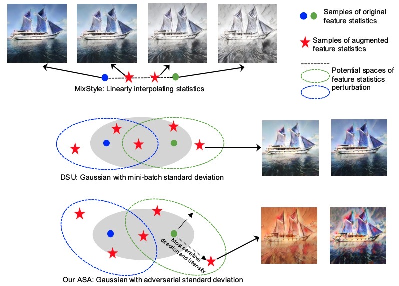

# AdvStyle
The official codes of paper: [Adversarial Style Augmentation for Domain Generalization](https://arxiv.org/pdf/2301.12643.pdf)

**One Sentence Summary:** 
AdvStyle explores a broader style space over MixStyle, DSU, and EFDMix by searching for the most challenging domains via adversarial training. 

|  |
|:-------------:|
| Fig.1: MixStyle vs. DSU vs. AdvStyle |

To reproduce our results on cross-domain image classification, and cross-domain person re-identification, 
please find the code in `./imcls`, and `./reid`, respectively.

This work was initially finished in Mar. 2022 and submitted to ECCV2022 and AAAI2023. 
The corresponding review can be found at: [ECCV2022_review](ECCV2022_review.pdf) and [AAAI2023_review](AAAI2023_review.pdf).
Considering that a similar idea to AdvStyle has been published in [NIPS2022](https://openreview.net/forum?id=lXUp6skJ7r),
we just remain this paper as a Technique Report for the reference of the community.

To cite AdvStyle in your publications, please use the following bibtex entry:
```
@article{zhang2023adversarial,
  title={Adversarial Style Augmentation for Domain Generalization},
  author={Zhang, Yabin and Deng, Bin and Li, Ruihuang and Jia, Kui and Zhang, Lei},
  journal={arXiv preprint arXiv:2301.12643},
  year={2023}
}
```
